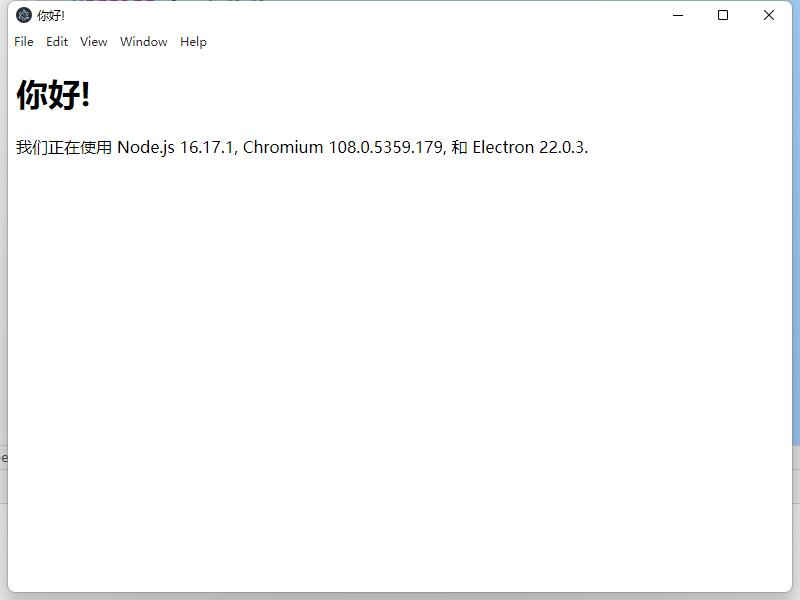
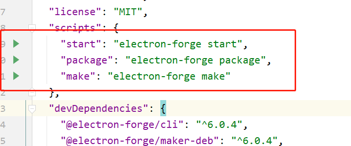
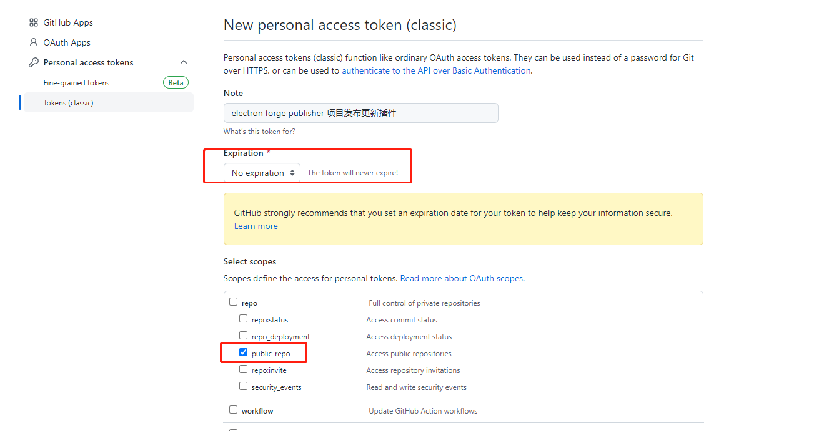
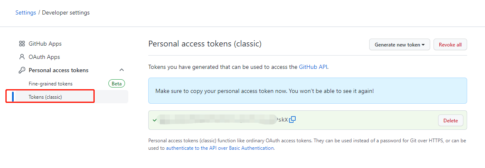
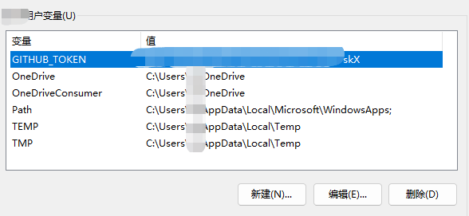
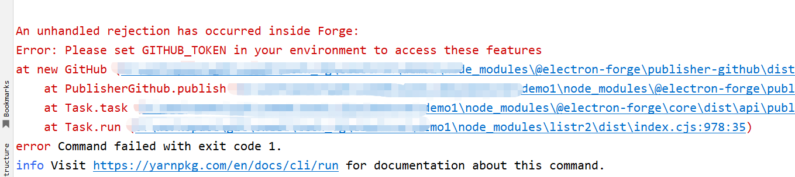

# electron学习

## 介绍

- 利用前端技术开发桌面端应用程序
- 技术体系html、css、JavaScript、nodejs、chromium、es6、npm、yarn、vue...
- 利用chromium内核作为框架、nodejs作为原生访问支持、js、html、css作为前端交互展示

## HelloWorld

### 创建项目

```shell
mkdir my-electron-app && cd my-electron-app
npm init
```

```shell
mkdir my-electron-app && cd my-electron-app
yarn init
```

> - npm或者yarn工具
> - 初始化一个nodejs程序
> - 这条命令会帮您配置 package.json 中的一些字段。 为本教程的目的，有几条规则需要遵循：
>   - *入口点* 应当是 `main.js`  或者 `index.js`，入口文件可以换做其他的
>   - *author* (作者)、*license* (开源许可证) 和 *description* (描述) 可以为任意内容，不过在晚些的 [打包应用程序](https://www.electronjs.org/zh/docs/latest/tutorial/打包教程) 步骤中可能是需要的。

```json
{
  "name": "demo1",
  "version": "1.0.0",
  "description": "my first electron app",
  "main": "main.js",
  "author": "hclz",
  "license": "MIT"
 }
```

### 安装electron依赖

```shell
npm install electron --save-dev
yarn add electron --dev
```

```json
{
  "name": "demo1",
  "version": "1.0.0",
  "description": "my first electron app",
  "main": "main.js",
  "author": "hclz",
  "license": "MIT",
  "devDependencies": {
    "electron": "19.0.0"
  }
}
```

### 编写入口文件main.js

> 您在 package.json 中指定的脚本文件 [`main`](https://docs.npmjs.com/cli/v7/configuring-npm/package-json#main) 是所有 Electron 应用的入口点。 这个文件控制 **主程序 (main process)**，它运行在 Node.js 环境里，负责控制您应用的生命周期、显示原生界面、执行特殊操作并管理渲染器进程 (renderer processes)，稍后会详细介绍。

```javascript
console.log(`欢迎来到 Electron 👋`)
```

### 创建ui视图文件index.html

> 在 Electron 中，每个窗口展示一个页面，后者可以来自本地的 HTML，也可以来自远程 URL。 在本例中，您将会装载本地的文件。 在您项目的根目录中创建一个 `index.html` 文件，并写入下面的内容：

```html
<!DOCTYPE html>
<html>
  <head>
    <meta charset="UTF-8">
    <!-- https://developer.mozilla.org/zh-CN/docs/Web/HTTP/CSP -->
    <meta http-equiv="Content-Security-Policy" content="default-src 'self'; script-src 'self'">
    <title>你好!</title>
  </head>
  <body>
    <h1>你好!</h1>
    我们正在使用 Node.js <span id="node-version"></span>,
    Chromium <span id="chrome-version"></span>,
    和 Electron <span id="electron-version"></span>.
  </body>
</html>
```

### main.js入口文件创建窗口，加载ui文件

```javascript
const { app, BrowserWindow } = require('electron')

const createWindow = () => {
  const win = new BrowserWindow({
    width: 800,
    height: 600,
  })

  win.loadFile('index.html')
}

app.whenReady().then(() => {
  createWindow()
})
```

> 在第一行中，我们使用 CommonJS 语法导入了两个 Electron 模块：
>
> - [app](https://www.electronjs.org/zh/docs/latest/api/app)，它控制您的应用的事件生命周期。
> - [BrowserWindow](https://www.electronjs.org/zh/docs/latest/api/browser-window)，它负责创建和管理应用的窗口。
>
> Electron 的很多核心模组是 Node.js [事件触发器](https://nodejs.org/api/events.html#events)，遵守 Node.js 的异步事件驱动架构。 app 模块就是其中一个。
>
> 在 Electron 中，只有在 app 模组的 [`ready`](https://www.electronjs.org/zh/docs/latest/api/app#event-ready) 事件能触发后才能创建 BrowserWindows 实例。 您可以借助 [`app.whenReady()`](https://www.electronjs.org/zh/docs/latest/api/app#appwhenready) API 来等待此事件，并在该 API 的 promise 被 resolve 时调用 `createWindow()` 方法。

### 预加载js

> - 预加载脚本包含在浏览器窗口加载网页之前运行的代码。 其可访问 DOM 接口和 Node.js 环境，并且经常在其中使用 `contextBridge` 接口将特权接口暴露给渲染器。
>
> - 由于主进程和渲染进程有着完全不同的分工，Electron 应用通常使用预加载脚本来设置进程间通信 (IPC) 接口以在两种进程之间传输任意信息。

Electron 的主进程是一个拥有着完全操作系统访问权限的 Node.js 环境。 除了 [Electron 模组](https://www.electronjs.org/zh/docs/latest/api/app) 之外，你也可以使用 [Node.js 内置模块](https://nodejs.org/dist/latest/docs/api/) 和所有通过 npm 安装的软件包。 另一方面，出于安全原因，渲染进程默认跑在网页页面上，而并非 Node.js里。

为了将 Electron 的不同类型的进程桥接在一起，我们需要使用被称为 **预加载** 的特殊脚本。

现在，最后要做的是输出Electron的版本号和它的依赖项到你的web页面上。

在主进程通过Node的全局 `process` 对象访问这个信息是微不足道的。 然而，你不能直接在主进程中编辑DOM，因为它无法访问渲染器 `文档` 上下文。 它们存在于完全不同的进程！

> 注意：如果您需要更深入地了解Electron进程，请参阅 [进程模型](https://www.electronjs.org/zh/docs/latest/tutorial/process-model) 文档。

这是将 **预加载** 脚本连接到渲染器时派上用场的地方。 预加载脚本在渲染器进程加载之前加载，并有权访问两个 渲染器全局 (例如 `window` 和 `document`) 和 Node.js 环境。

> - html环境中无法访问node环境
>
> - 需要使用预加载脚本在渲染器进程加载之前进行加载
>
> - BrowserWindow 的预加载脚本运行在具有 HTML DOM 和 Node.js、Electron API 的有限子集访问权限的环境中。
>
> - 从 Electron 20 开始，预加载脚本默认 **沙盒化** ，不再拥有完整 Node.js 环境的访问权。 实际上，这意味着你只拥有一个 polyfilled 的 `require` 函数，这个函数只能访问一组有限的 API。
>
>   | 可用的 API            | 详细信息                                                     |
>   | --------------------- | ------------------------------------------------------------ |
>   | Electron 模块         | 渲染进程模块                                                 |
>   | Node.js 模块          | [`events`](https://nodejs.org/api/events.html)、[`timers`](https://nodejs.org/api/timers.html)、[`url`](https://nodejs.org/api/url.html) |
>   | Polyfilled 的全局模块 | [`Buffer`](https://nodejs.org/api/buffer.html)、[`process`](https://www.electronjs.org/zh/docs/latest/api/process)、[`clearImmediate`](https://nodejs.org/api/timers.html#timers_clearimmediate_immediate)、[`setImmediate`](https://nodejs.org/api/timers.html#timers_setimmediate_callback_args) |
>
> - 预加载脚本像 Chrome 扩展的 [内容脚本](https://developer.chrome.com/docs/extensions/mv3/content_scripts/)（Content Script）一样，会在渲染器的网页加载之前注入。 如果你想向渲染器加入需要特殊权限的功能，你可以通过 [contextBridge](https://www.electronjs.org/zh/docs/latest/api/context-bridge) 接口定义 [全局对象](https://developer.mozilla.org/en-US/docs/Glossary/Global_object)。

### 窗口的生命周期

> 应用窗口在不同操作系统中的行为也不同。 Electron 允许您自行实现这些行为来遵循操作系统的规范，而不是采用默认的强制执行。 您可以通过监听 app 和 BrowserWindow 模组的事件，自行实现基础的应用窗口规范。
>
> 在 Windows 和 Linux 上，我们通常希望在关闭一个应用的所有窗口后让它退出。 若要在 Electron 中实现这一点，您可以监听 [`window-all-closed`](https://www.electronjs.org/zh/docs/latest/api/app#event-window-all-closed) 事件，并调用 [`app.quit()`](https://www.electronjs.org/zh/docs/latest/api/app#appquit) 来让应用退出。这不适用于 macOS。
>
> 与前二者相比，即使没有打开任何窗口，macOS 应用通常也会继续运行。 在没有窗口可用时调用 app 会打开一个新窗口。
>
> 为了实现这一特性，可以监听模组的 [`activate`](https://www.electronjs.org/zh/docs/latest/api/app#event-activate-macos) 事件，如果没有任何活动的 BrowserWindow，调用 `createWindow()` 方法新建一个。
>
> 因为窗口无法在 `ready` 事件前创建，你应当在你的应用初始化后仅监听 `activate` 事件。 要实现这个，仅监听 `whenReady()` 回调即可。

- windows & linux

```javascript
app.on('window-all-closed', () => {
  if (process.platform !== 'darwin') app.quit()
})
```

- mac

```javascript
app.whenReady().then(() => {
  createWindow()

  app.on('activate', () => {
    if (BrowserWindow.getAllWindows().length === 0) createWindow()
  })
})
```

### 完整代码

#### package.js

```javascript
{
  "name": "demo1",
  "version": "1.0.0",
  "description": "my first electron app",
  "main": "main.js",
  "author": "hclz",
  "license": "MIT",
  "scripts": {
    "start": "electron-forge start",
    "package": "electron-forge package",
    "make": "electron-forge make"
  },
  "devDependencies": {
    "@electron-forge/cli": "^6.0.4",
    "@electron-forge/maker-deb": "^6.0.4",
    "@electron-forge/maker-rpm": "^6.0.4",
    "@electron-forge/maker-squirrel": "^6.0.4",
    "@electron-forge/maker-zip": "^6.0.4",
    "electron": "^22.0.3"
  },
  "dependencies": {
    "electron-squirrel-startup": "^1.0.0"
  }
}
```

#### main.js

```javascript
// main.js

// electron 模块可以用来控制应用的生命周期和创建原生浏览窗口
const { app, BrowserWindow } = require('electron')
const path = require('path')

const createWindow = () => {
  // 创建浏览窗口
  const mainWindow = new BrowserWindow({
    width: 800,
    height: 600,
    webPreferences: {
      preload: path.join(__dirname, 'preload.js')
    }
  })

  // 加载 index.html
  mainWindow.loadFile('index.html')

  // 打开开发工具
  // mainWindow.webContents.openDevTools()
}

// 这段程序将会在 Electron 结束初始化
// 和创建浏览器窗口的时候调用
// 部分 API 在 ready 事件触发后才能使用。
app.whenReady().then(() => {
  createWindow()

  app.on('activate', () => {
    // 在 macOS 系统内, 如果没有已开启的应用窗口
    // 点击托盘图标时通常会重新创建一个新窗口
    if (BrowserWindow.getAllWindows().length === 0) createWindow()
  })
})

// 除了 macOS 外，当所有窗口都被关闭的时候退出程序。 因此, 通常
// 对应用程序和它们的菜单栏来说应该时刻保持激活状态, 
// 直到用户使用 Cmd + Q 明确退出
app.on('window-all-closed', () => {
  if (process.platform !== 'darwin') app.quit()
})

// 在当前文件中你可以引入所有的主进程代码
// 也可以拆分成几个文件，然后用 require 导入。
```

#### 预加载js preload.js

##### 直接访问

```javascript
// preload.js

// 所有的 Node.js API接口 都可以在 preload 进程中被调用.
// 它拥有与Chrome扩展一样的沙盒。
window.addEventListener('DOMContentLoaded', () => {
  const replaceText = (selector, text) => {
    const element = document.getElementById(selector)
    if (element) element.innerText = text
  }

  for (const dependency of ['chrome', 'node', 'electron']) {
    replaceText(`${dependency}-version`, process.versions[dependency])
  }
})

//main.js
// 创建浏览窗口
const mainWindow = new BrowserWindow({
    width: 800,
    height: 600,
    webPreferences: {
        preload: path.join(__dirname, 'preload.js')
    }
})
```

这里使用了两个Node.js概念：

- [`__dirname`](https://nodejs.org/api/modules.html#modules_dirname) 字符串指向当前正在执行脚本的路径 (在本例中，它指向你的项目的根文件夹)。
- [`path.join`](https://nodejs.org/api/path.html#path_path_join_paths) API 将多个路径联结在一起，创建一个跨平台的路径字符串。

##### 暴露为全局变量

```
const { contextBridge } = require('electron')

contextBridge.exposeInMainWorld('versions', {
  node: () => process.versions.node,
  chrome: () => process.versions.chrome,
  electron: () => process.versions.electron,
  // 能暴露的不仅仅是函数，我们还可以暴露变量
})
```

> 获取暴露的全局变量（渲染进程中的dom js程序）
>
> ```javascript
> const information = document.getElementById('info')
> information.innerText = `本应用正在使用 Chrome (v${versions.chrome()}), Node.js (v${versions.node()}), 和 Electron (v${versions.electron()})`
> ```

#### ui文件index.html

```html
<!--index.html-->

<!DOCTYPE html>
<html>
  <head>
    <meta charset="UTF-8">
    <!-- https://developer.mozilla.org/en-US/docs/Web/HTTP/CSP -->
    <meta http-equiv="Content-Security-Policy" content="default-src 'self'; script-src 'self'">
    <title>你好!</title>
  </head>
  <body>
    <h1>你好!</h1>
    我们正在使用 Node.js <span id="node-version"></span>,
    Chromium <span id="chrome-version"></span>,
    和 Electron <span id="electron-version"></span>.

    <！-- 您也可以此进程中运行其他文件 -->
    <script src="./renderer.js"></script>
  </body>
</html>
```

### 进程间通信

> - electron存在两个进程
>   - 主进程，含nodejs环境，可以拥有原生访问操作系统的所有权限
>   - 渲染进程，可以操作dom
>   - 二者不能直接通信
> - 我们之前提到，Electron 的主进程和渲染进程有着清楚的分工并且不可互换。 这代表着无论是从渲染进程直接访问 Node.js 接口，亦或者是从主进程访问 HTML 文档对象模型 (DOM)，都是不可能的。
> - 解决这一问题的方法是使用进程间通信 (IPC)。可以使用 Electron 的 `ipcMain` 模块和 `ipcRenderer` 模块来进行进程间通信。 为了从你的网页向主进程发送消息，你可以使用 `ipcMain.handle` 设置一个主进程处理程序（handler），然后在预处理脚本中暴露一个被称为 `ipcRenderer.invoke` 的函数来触发该处理程序（handler）。
> - 我们将向渲染器添加一个叫做 `ping()` 的全局函数来演示这一点。这个函数将返回一个从主进程翻山越岭而来的字符串。

> 1、预加载脚本preload.js

```javascript
const { contextBridge, ipcRenderer } = require('electron')

contextBridge.exposeInMainWorld('versions', {
  node: () => process.versions.node,
  chrome: () => process.versions.chrome,
  electron: () => process.versions.electron,
  ping: () => ipcRenderer.invoke('ping'),
  // 能暴露的不仅仅是函数，我们还可以暴露变量
})
```

> IPC 安全

可以注意到我们使用了一个辅助函数来包裹 `ipcRenderer.invoke('ping')` 调用，而并非直接通过 context bridge 暴露 `ipcRenderer` 模块。 你**永远**都不会想要通过预加载直接暴露整个 `ipcRenderer` 模块。 这将使得你的渲染器能够直接向主进程发送任意的 IPC 信息，会使得其成为恶意代码最强有力的攻击媒介。

> 2、在主进程中设置你的 `handle` 监听器。 我们在 HTML 文件加载*之前*完成了这些，所以才能保证在你从渲染器发送 `invoke` 调用之前处理程序能够准备就绪。

```javascript
const { app, BrowserWindow, ipcMain } = require('electron')
const path = require('path')

const createWindow = () => {
  const win = new BrowserWindow({
    width: 800,
    height: 600,
    webPreferences: {
      preload: path.join(__dirname, 'preload.js'),
    },
  })
  ipcMain.handle('ping', () => 'pong')
  win.loadFile('index.html')
}
app.whenReady().then(createWindow)
```

> 3、html渲染进程中使用ipc绑定的主进程处理方法，将发送器与接收器设置完成之后，现在你可以将信息通过刚刚定义的 `'ping'` 通道从渲染器发送至主进程当中。

```javascript
const func = async () => {
  const response = await window.versions.ping()
  console.log(response) // 打印 'pong'
}

func()
```

### electron开发设计维度

> - `增加渲染进程的网页应用代码复杂度`
>
>   Electron 特供的资源是非必要的。 在 Electron 中建立一个漂亮的待办列表只是将你的 Electron BrowserWindow 指向一个漂亮的待办列表网络应用。 说到底，你还是使用在 Web 开发中相同的工具 (HTML, CSS, JavaScript) 来构建你的渲染器 UI。
>
> - `深化与操作系统和 Node.js 的集成`
>
>   Electron 同时提供了丰富的工具集，可以让你和桌面环境整合起来。从建立托盘图标到添加全局的快捷方式，再到显示原生的菜单，都不在话下。 Electron 还赋予你在主进程中访问 Node.js 环境的所有能力。 这组能力使得 Electron 应用能够从浏览器运行网站中脱胎换骨

### 启动electron程序

您希望能够执行 Electron 如下所示，在您的 [`package.json`](https://docs.npmjs.com/cli/v7/using-npm/scripts)配置文件中的`scripts`字段下增加一条`start`命令：

```json
{
  "scripts": {
    "start": "electron ."
  }
}
```

```
npm start
yarn start
```



### electron打包发布

- Electron 的核心模块中没有捆绑任何用于打包或分发文件的工具。 如果您在开发模式下完成了一个 Electron 应用，需要使用额外的工具来打包应用程序 (也称为**可分发文件**) 并分发给用户 。 可分发文件可以是安装程序 (例如 Windows 上的 MSI) 或者绿色软件 (例如 macOS 上的 `.app` 文件)。
- Electron Forge 是一个处理 Electron 应用程序打包与分发的一体化工具。 在工具底层，它将许多现有的 Electron 工具 (例如 [`electron-packager`](https://github.com/electron/electron-packager)、 [`@electron/osx-sign`](https://github.com/electron/osx-sign)、[`electron-winstaller`](https://github.com/electron/windows-installer) 等) 组合到一起，因此您不必费心处理不同系统的打包工作。

#### electron forge打包

> - 安装依赖
>
>   ```shell
>   npm install --save-dev @electron-forge/cli
>   yarn add --dev @electron-forge/cli
>   ```
>
> - 导入electron forge项目
>
>   ```shell
>   npx electron-forge import
>   ```
>
>   本质是在当前项目的package.json中加入electron forge的脚本。转换脚本完成后，Forge 会将一些脚本添加到您的 `package.json` 文件中。
>
>   
>
>   ```json
>     //...
>     "scripts": {
>       "start": "electron-forge start",
>       "package": "electron-forge package",
>       "make": "electron-forge make"
>     },
>     //...
>   ```
>
>   > 注意：**npx是执行Node软件包的工具**
>   >
>   > - 若没有npx，要执行一个软件包，必须通过其本地路径运行来完成
>   >
>   > - 当执行 $ npx <command> 相关命令的时候，npx 会先本地找（可以是项目中的也可以是本机的）寻找这个 command。
>   >
>   >   找到了：就用本地的版本
>   >
>   >   没找到：直接下载最新版本（这里是在缓存里），完成命令要求
>   >
>   >   使用完之后就会完全清除，不会在本机或项目留下任何东西
>   >
>   >   这样就不会污染本机、永远使用最新版本的 dependency
>
> - 导入electron forge项目后会自动生成 `forge.config.js` 文件
>
>   ```javascript
>   module.exports = {
>     packagerConfig: {},
>     rebuildConfig: {},
>     makers: [
>       {
>         name: '@electron-forge/maker-squirrel',
>         config: {},
>       },
>       {
>         name: '@electron-forge/maker-zip',
>         platforms: ['darwin'],
>       },
>       {
>         name: '@electron-forge/maker-deb',
>         config: {},
>       },
>       {
>         name: '@electron-forge/maker-rpm',
>         config: {},
>       },
>     ],
>   };
>   ```
>
> - make命令打包
>
>   该 `make` 命令包含两步：
>
>   1. 它将首先运行 `electron-forge package` ，把您的应用程序 代码与 Electron 二进制包结合起来。 完成打包的代码将会被生成到一个特定的文件夹中。
>   2. 然后它将使用这个文件夹为每个 maker 配置生成一个可分发文件。
>
>   在脚本运行后，您应该看到一个 `out` 文件夹，其中包括可分发文件与一个包含其源码的文件夹。
>
> - 程序签名
>
>   - 将桌面应用程序分发给终端用户前，我们 *强烈推荐* 您对 Electron 应用进行 **代码签名**。 代码签名是交付桌面应用程序的重要组成部分，并且它对于应用程序的自动更新功能 (将会在教程最后部分讲解) 来说是必需的。
>
>   - 代码签名是一种可用于证明桌面应用程序是由已知来源创建的安全技术。 Windows 和 macOS 拥有其特定的代码签名系统，这将使用户难以下载或启动未签名的应用程序。
>
>   - 在 macOS 上，代码签名是在应用程序打包时完成的。 而在 Windows 中，则是对可分发文件进行签名操作。 如果您已经拥有适用于 Windows 和 macOS 的代码签名证书，可以在 Forge 配置中设置您的凭据。
>
>   - macos
>
>     ```javascript
>     module.exports = {
>       packagerConfig: {
>         osxSign: {},
>         //...
>         osxNotarize: {
>           tool: 'notarytool',
>           appleId: process.env.APPLE_ID,
>           appleIdPassword: process.env.APPLE_PASSWORD,
>           teamId: process.env.APPLE_TEAM_ID,
>         }
>         //...
>       }
>     }
>     ```
>
>   - windows
>
>     ```javascript
>     module.exports = {
>       //...
>       makers: [
>         {
>           name: '@electron-forge/maker-squirrel',
>           config: {
>             certificateFile: './cert.pfx',
>             certificatePassword: process.env.CERTIFICATE_PASSWORD,
>           },
>         },
>       ],
>       //...
>     }
>     ```

#### 基于github的发布

> ## update.electronjs.org

Electron 官方在 [https://update.electronjs.org](https://update.electronjs.org/) 上为开源应用程序提供了免费的自动更新服务。 使用它有以下几点要求：

- 你的应用在 macOS 或 Windows 上运行
- 你的应用有一个公开的 GitHub 仓库
- 应用程序需要发布到 [GitHub releases](https://docs.github.com/en/repositories/releasing-projects-on-github/managing-releases-in-a-repository) 中
- 应用程序需要完成 [签名](https://www.electronjs.org/zh/docs/latest/tutorial/code-signing)

> - 创建一个公开的GitHub仓库
>
> - electron forge发布插件
>
>   - Electron Forge 的 [Publisher](https://www.electronforge.io/config/publishers) 插件可以自动将打包的应用程序分发到各种来源。 在本教程中，我们将演示使用 GitHub Publisher 将代码发布到 GitHub releases 中。
>
> - 生成个人令牌，授权forge访问GitHub仓库
>
>   - 未经许可，Forge无法向GitHub 上的任何仓库发布。 你需要通过一个认证令牌，授权 Forge 使用 GitHub 的发布功能。 最简单的方法是 [创建一个新的个人访问令牌 (PAT)](https://github.com/settings/tokens/new) 范围为 `public_repo`, 它将给你的公共资源库提供写访问权限。 **请确保此令牌不外泄。**
>
>   - https://github.com/settings/tokens/new
>
>     
>
>     
>
> - 设置github token环境变量
>
>   
>
> - 安装forge publisher插件
>
>   ```shell
>   npm install --save-dev @electron-forge/publisher-github
>   yarn add --dev @electron-forge/publisher-github
>   ```
>
> - 配置forge.config.js
>
>   ```javascript
>   module.exports = {
>     publishers: [
>       {
>         name: '@electron-forge/publisher-github',
>         config: {
>           repository: {
>             owner: 'github-user-name',
>             name: 'github-repo-name',
>           },
>           prerelease: false,
>           draft: true,
>         },
>       },
>     ],
>   }
>   ```
>
> - package.json中添加发布脚本
>
>   ```javascript
>     //...
>     "scripts": {
>       "start": "electron-forge start",
>       "package": "electron-forge package",
>       "make": "electron-forge make",
>       "publish": "electron-forge publish"
>     },
>     //...
>   ```
>
> - 检测是否存在更新代码
>
>   - 至此我们有了一个通过 GitHub 发布的功能性发布系统， 我们现在需要告诉我们的 Electron 应用来下载更新，而且是每当新版本出现时都需要更新。 Electron 应用通过 [autoUpdater](https://www.electronjs.org/zh/docs/latest/api/auto-updater) 模块来实现此功能, 此模块可以从更新服务源中读取信息, 并检查是否有一个新版本可供下载.
>   
>   - 网址是 update.electronjs.org 的服务器提供了一个兼容更新源. 比如, Electron Fiddle v0.28.0 将会检查接口 https://update.electronjs.org/electron/fiddle/darwin/v0.28.0 来查看是否有新的 GitHub 版本可用.
>   
>   - 一旦你的发布版本被推送到 GitHub, 对应的更新服务 update.electronjs.org 将会自动对接你的应用. 剩下的唯一步骤是使用 autoUpdater 模块配置源。为了让整个过程更加简单, Electron 团队维护 [`update-electron-app`](https://github.com/electron/update-electron-app) 模块, 它在一次函数调用中为 update.electronjs.org 设置了 autoUpdater 样板，无需配置。 这个模块将搜索 update.electronjs.org 源中与项目内 package.json 的`"repository"` 字段匹配的部分。
>   
>   - 安装更新检查模块
>   
>     ```shell
>     yarn add update-electron-app
>     ```
>   
>   - 导入模块并在主进程中立即调用 `main.js`
>   
>     ```javascript
>     require('update-electron-app')()
>     ```
>   
>   - 一旦你的应用程序被打包，它将在你发布每个新的 GitHub 版本时更新自己。默认情况下，这个模块会在应用启动的时候检查更新，然后每隔十分钟再检查一次。 当发现了一个更新，它会自动在后台下载。 当下载完成后，会显示对话框允许用户重启应用。
>   
> - 发布
>
>   ```shell
>   npm run publish
>   yarn run publish
>   ```
>
>   

### 总结

总结我们所做的所有步骤：

- 我们启动了一个Node.js程序，并将Electron添加为依赖。
- 我们创建了一个 `main.js` 脚本来运行我们的主要进程，它控制我们的应用程序 并且在 Node.js 环境中运行。 在此脚本中， 我们使用 Electron 的 `app` 和 `BrowserWindow` 模块来创建一个浏览器窗口，在一个单独的进程(渲染器)中显示网页内容。
- 为了访问渲染器中的Node.js的某些功能，我们在 `BrowserWindow` 的构造函数上附加了一个预加载脚本。